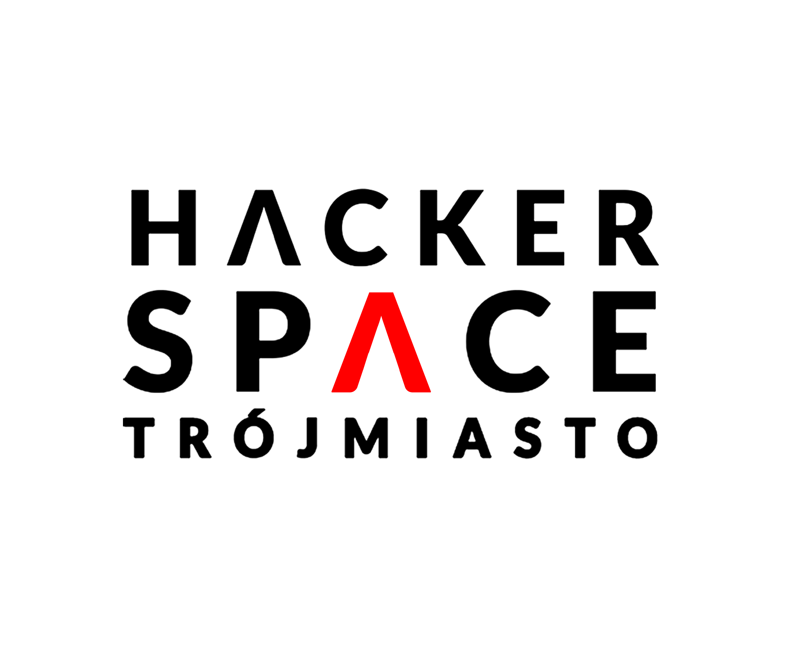
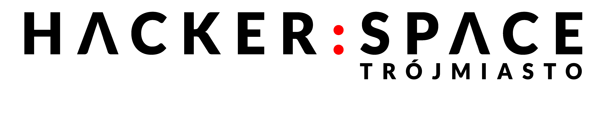

# Księga Znaku Hackerspace Trójmiasto

Zasady korzystania z logo Hackerspace Trójmiasto, by zachować jego czytelność i spójność.

## Logo

Oficjalne logo Hackerspace Trójmiasto występuje w 2 wariantach - oba mogą być stosowane, jednak wariant 1 jest częściej wykorzystywany i bardziej rozpoznawalny. 

### Wariant 1 najczęstszy

### Wariant 2 - nawiązujący do logo CODE:ME

### Kolory

Oba warianty są dostępne w 3 wersjach kolorystycznych:

- czarno-czerwone
- biało-czerwone
- monochromatyczne

Kody kolorów (HEX):

- czerwony #FF0000
- czarny #000000
- biały #FFFFFF

### Zalecenia

- Wybrać logo w wersji kolorystycznej, która zapewnia jak największy kontrast z tłem
- Nie zmieniać proporcji logo

## Zasoby

- [ttsky-hs3logo-ieee](https://github.com/magnetoField/ttsky-hs3logo-ieee) - VGA logo display dla Hackerspace Trójmiasto, wygenerowany całkowicie po stronie hardware używając Verilog
